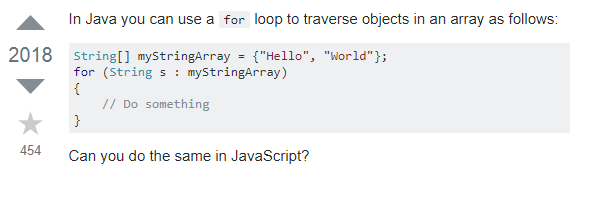
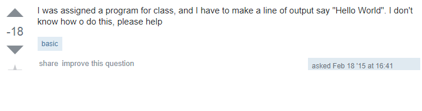

  A teacher in high school once told me that there is no such thing as a dumb question. At the time, I didn't give it much thought and proceeded to go through the same motions of an average high school student. As the years went by, and going to college, the curriculum gets more challenging, material gets more complex and I start to wonder if what my teacher said back then were really true. A combination of reading Eric Raymonds essay and seeing questions from Stackoverflow got me believing that there is a certain threshold you have to go through in asking smart questions. You have to be explicit, you need to provide detail, in such a way that conveys to the reader that you have thouroughly investigated the topic and have done all that you are able to do through your own means. 
  
  
  
  I think what makes that threshold low for most people are the basic questions that we ask in our daily lives. We get so accustomed to the simplicity of questions like "How are you?", "Are you going to X this weekend?", "Is this the right X for Y?", etc. Well, we get so accustomed to them that we expect simple answers to these questions in an instantaneous reply but not ALL questions have simple answers. Some answers are long, complex, or haven't even been answered yet. I think another part of asking smart questions is being able to know the type of answer it gets. So is there such a thing as a dumb question? I'd say to a certain degree.  

  
