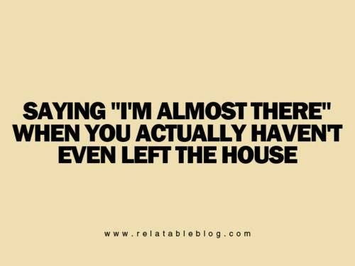

When dealing with the purpose of aesthetics, there is a simple ground rule that needs to be met, make it look pretty. In this week's module that deals with semantic UI, we are thought a framework that is both user friendly in its syntax and thematic in its usage. Its quite simple to call a semantic ui class that gives proper layouts and aesthetics which would be written in a complex manner if you were to write it in raw html/css. That being said, it is defintely worth while to learn this framework.

When I say user friendly, I mean we don't need to write our code, in some of kind of code that needs to be deciphered. Variable names, class names, method names from what we have learned thus far in our basic programming languages have been in encrypted so to speak and that we need to make these names have meaning yet still follow the coding standards. I get kind of tired of that kind of thing, where you need to see words behind actual words. For instance, in normal conversation, where a person would say something like a fact or statment but what that person was really feeling was the exact oposite!

As we all know, when that kind of thing comes up, you sort of need to think outside the box, or read inside the lines. I myself am a fan of being absolutely direct and semantic UI sort of fufills that desire. Granted, just like any other language or framework, you need to get accustomed to the syntax. Well you'd think "Hey because semantic UI makes things easier, shouldn't it make writing easier as well?", but no, You still need to work on basic html practices because not everything can be oversimplified using semantic UI. All the little things in html will still be there and are neccesary for your website to function properly. That's what I learned when I was first learning this framework.       
