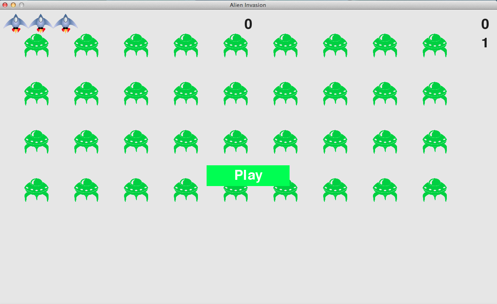

An assignment for ICS 215 where we had to modify the existing python code for the game Alien Invasion, to include a cheat code known as the infamous 'konami code' from those old super nintendo days. The goal of the project was to examine the python code of Alien Invasion from the net and figure out how and where to implement the cheat code. I started by looking at the main python file for the game and proceeded to looking at the game function files that were being imported to the main python file. Then figured out where I needed to implement a code sequence and coded in what would happen once the code is input by the user.

Once the right code is inputted by the user, the game is now enchanced so that you have more lives, you shoot your beams faster, and you also move faster as well. For this assignment, we all were responsible for our own work so I did everything for my own assignment. I learned how to modify existing code, especially when the code is modular and requires other files to function correctly. Doing this project also helped me understand basic python semantics and syntax. 

The basic Alien Invasion code can be found at [Github](https://github.com/patmessina/AlienInvasion).

