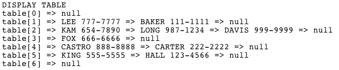

  

A project for ICS 211 where we were required to create a 'telephone directory' in Java using linked lists and hashing. A menu is  implemented for the user to be able to choose to add a contact(name and number only), find a contact, delete a contact, display the phone book, or exit the program. A contact is added to a hash by defining a person's contact info as a list object and setting the head and tail properties of the list as needed, the list is then added to the hash. Deleting a contact has a similar approach but requires that you replace the pointer to the previous contact to the next contact of the deleted contact. Retrieving is easier as you just need to match contact names and return a match.




Displaying the whole telephone book is a little arduous as you need to traverse through the hash table and for each hash value, traverse through each linked list and display each contact info in the list. There are also some error checking throughout the project like checking user input. Each person was responsible for their own projects so I did all the work on mine. I learned how to implement a basic data structure by doing this project and also how I can apply the material learned in class to real life needs.

Here is some code that illustrates the hash iniatialization:

```java
class TelephoneBook {

   private LinkedList[] hashArray = new LinkedList[7];
   
   /**
	 * Constructor for class TelephoneBook. initalizes each linked list
    * object in hash array
	 * 
	 */
   public TelephoneBook() {
      //initialize each list object in array
      for(int i = 0; i < hashArray.length; i++) 
         hashArray[i] = new LinkedList();
      
   }
```

Full source code at [Github](https://github.com/jessieflores/old-files/blob/master/FloresJessieProject.java).


