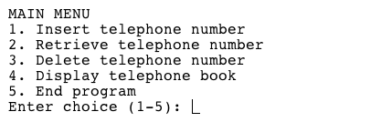

  

A project for ICS 211 where we were required to create a 'telephone directory' in Java using linked lists.   

For this project, I was the lead programmer who was responsible for programming the various capabilities of the mouse.  I started by programming the basics, such as sensor polling and motor actuation using interrupts.  From there, I then programmed the basic PD controls for the motors of the mouse.  The PD control the drive so that the mouse would stay centered while traversing the maze and keep the mouse driving straight.  I also programmed basic algorithms used to solve the maze such as a right wall hugger and a left wall hugger algorithm.  From there I worked on a flood-fill algorithm to help the mouse track where it is in the maze, and to map the route it takes.  We finished with the fastest mouse who finished the maze within our college.

Here is some code that illustrates how we read values from the line sensors:

```js
class TelephoneBook {

   private LinkedList[] hashArray = new LinkedList[7];
   
   /**
	 * Constructor for class TelephoneBook. initalizes each linked list
    * object in hash array
	 * 
	 */
   public TelephoneBook() {
      //initialize each list object in array
      for(int i = 0; i < hashArray.length; i++) 
         hashArray[i] = new LinkedList();
      
   }
```

You can learn more at the [UH Micromouse Website](http://www-ee.eng.hawaii.edu/~mmouse/about.html).


